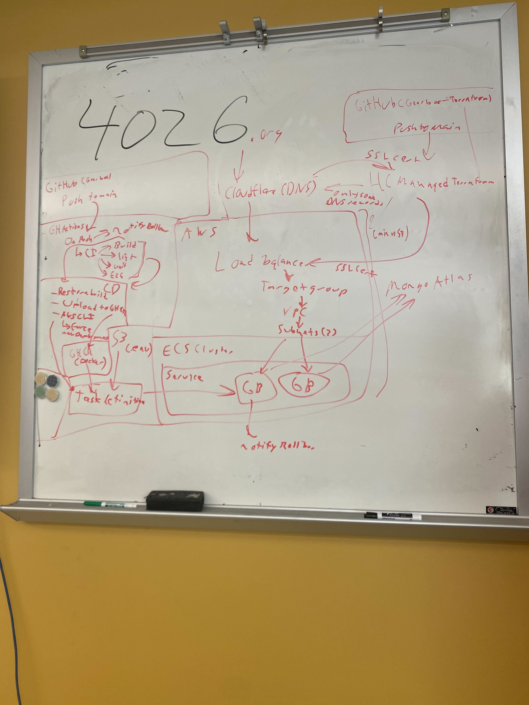

# Gearbox-Terraform

Terraform configuration for [Gearbox](https://github.com/Decatur-Robotics/Gearbox).

## Infrastructure Overview

Gearbox has a few core components:

- **AWS ECS** - The Gearbox servers themselves run on AWS ECS.
- **Cloudflare** - Our domain is connected to Cloudflare and we get SSL certificates from them. _Cloudflare is not fully managed by Terraform - only some of the DNS records are._
- **HashiCorp Managed Terraform** - Handles deployment for Terraform, but not the main Gearbox repo.
- **GitHub Actions** - Deployment and checks for the main Gearbox repo.
- **AWS S3** - Secrets are stored in an S3 bucket.
- **MongoDB Atlas** - The database is hosted on MongoDB Atlas. _MongoDB Atlas is not managed by Terraform._

## Licensed under a CC BY-NC-SA 4.0 license

Read the license [here](LICENSE.md).
